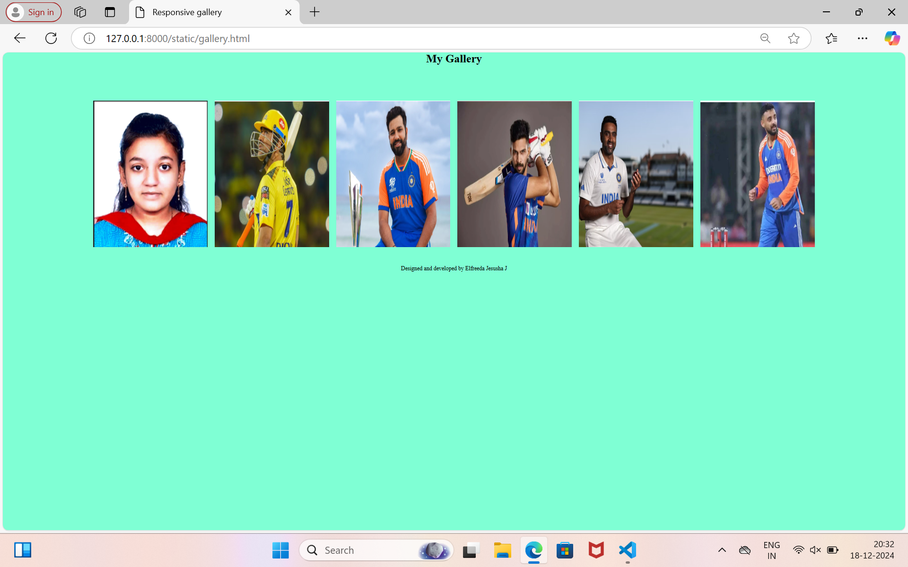

# Ex.08 Design of Interactive Image Gallery
## Date:19.12.2024

## AIM:
To design a web application for an inteactive image gallery with minimum five images.

## DESIGN STEPS:

### Step 1:
Clone the github repository and create Django admin interface.

### Step 2:
Change settings.py file to allow request from all hosts.

### Step 3:
Use CSS for positioning and styling.

### Step 4:
Write JavaScript program for implementing interactivity.

### Step 5:
Validate the HTML and CSS code.

### Step 6:
Publish the website in the given URL.

## PROGRAM :

```
gallery.html

<html>
<head>
    <title>Responsive gallery</title>
    <link rel="stylesheet" href="style.css">
</head>
<body>
    <h1 align="center">My Gallery</h1>
    <div class="fullImg" id="full-imgbox">
        
        <span onclick="closeFullImg()"></span>
    </div>
    <div class="img-gallery">
        
        
        
        
        
        
    </div>
<script>
    var full-imgbox = document.getElementById("full-imgbox");
    var full-img = document.getElementById("full-img");

    function openFullImg(pic){
        full-imgbox.style.display= "flex"; 
        full-imgbox.src=pic;
        
    }
</script>
<footer>
    <p align="center">Designed and developed by Elfreeda Jesusha J</p>
</footer>
</body>
</html>

style.css

*{
    margin: 0;
    padding: 0;
    font-family: 'Times New Roman', Times, serif
}
body{
    background-color: aquamarine;
}
.img-gallery{
    width: 80%;
    margin: 100px auto 50px;
    display: grid;
    grid-template-columns: repeat(auto-fit, minmax(250px, 1fr));
    grid-gap: 20px;
}
.img-gallery img{
    width: 100%;
    cursor: pointer;
}

.img-gallery img:hover{
    border-radius: 20px;
    box-shadow: 0 32px 75px rgba(68 , 77, 136, 0.2);
}
.fullImg{
    width: 100%;
    height: 100vh;
    background: rgba(0, 0, 0, 0);
    position: fixed;
    top: 0;
    left: 0;
    display: none;
    align-items: center;
    justify-content: center;

}

.fullImg img{
    width: 90%;
    max-width: 500px;

}
.fullImg span{
    position: absolute;
    top: 5%;
    right: 5%;
    font-size: 30px;
    color: antiquewhite;
}

```

## OUTPUT:




## RESULT:
The program for designing an interactive image gallery using HTML, CSS and JavaScript is executed successfully.
